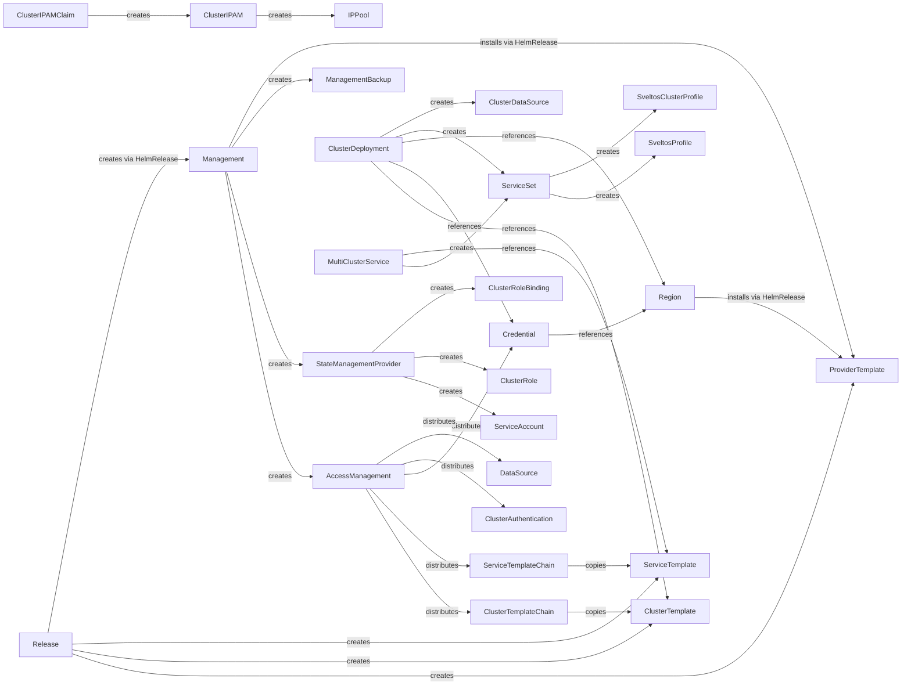
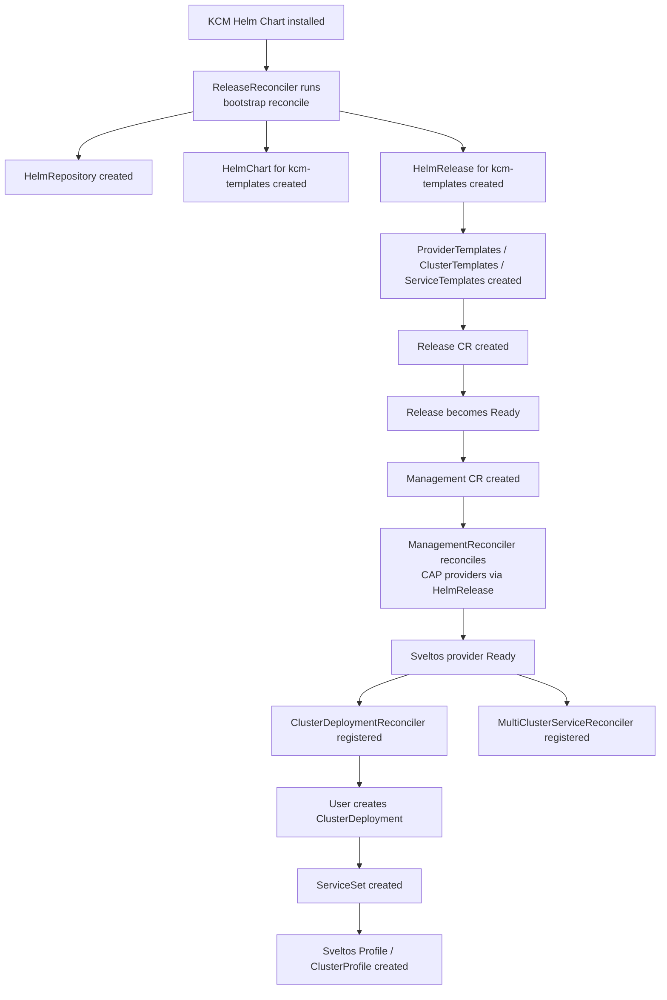
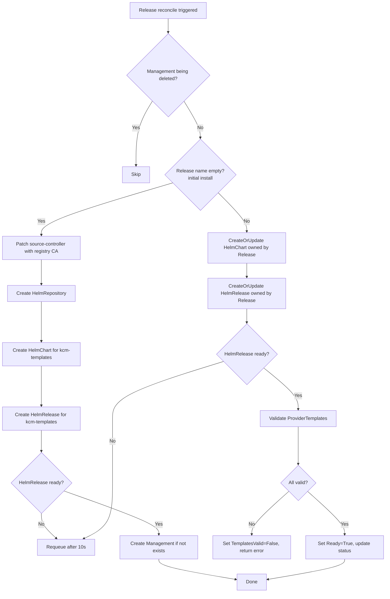
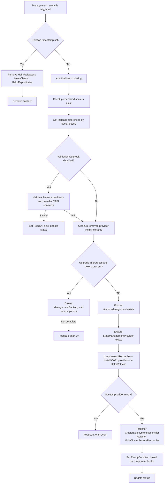
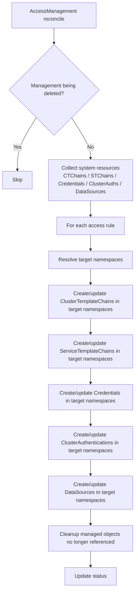
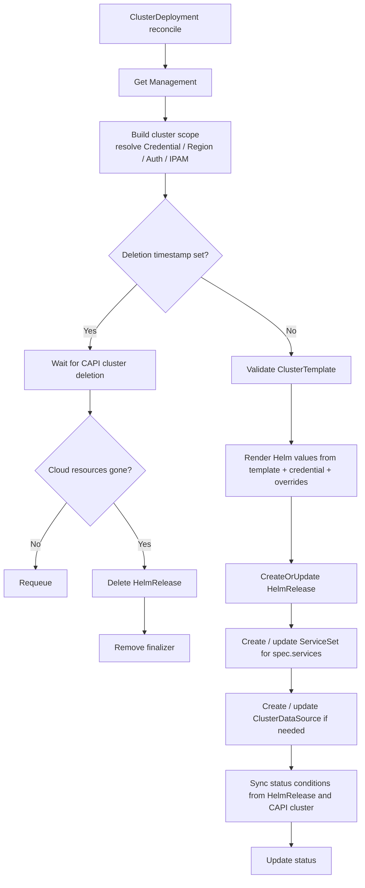
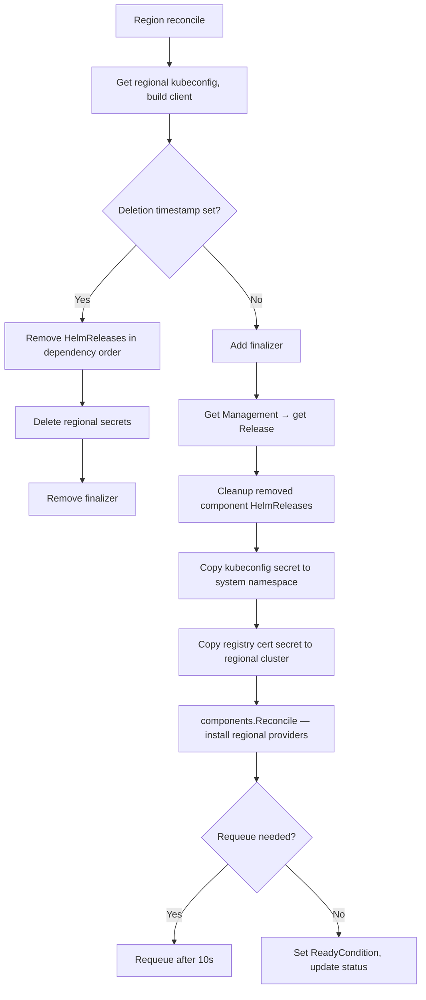
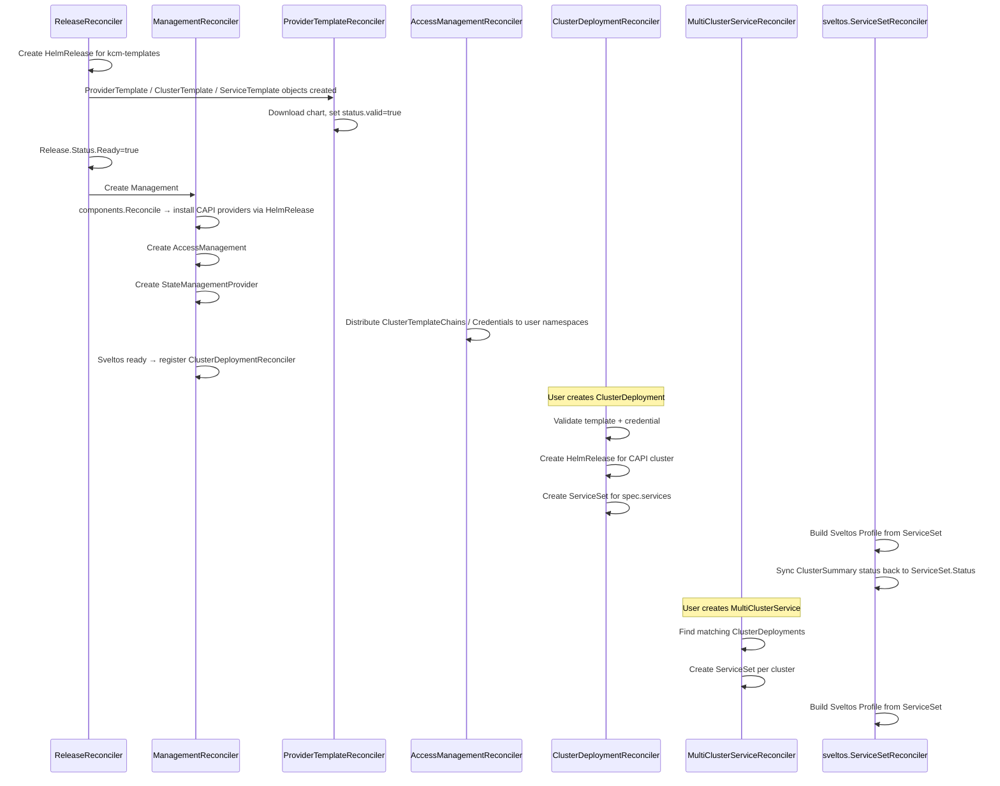
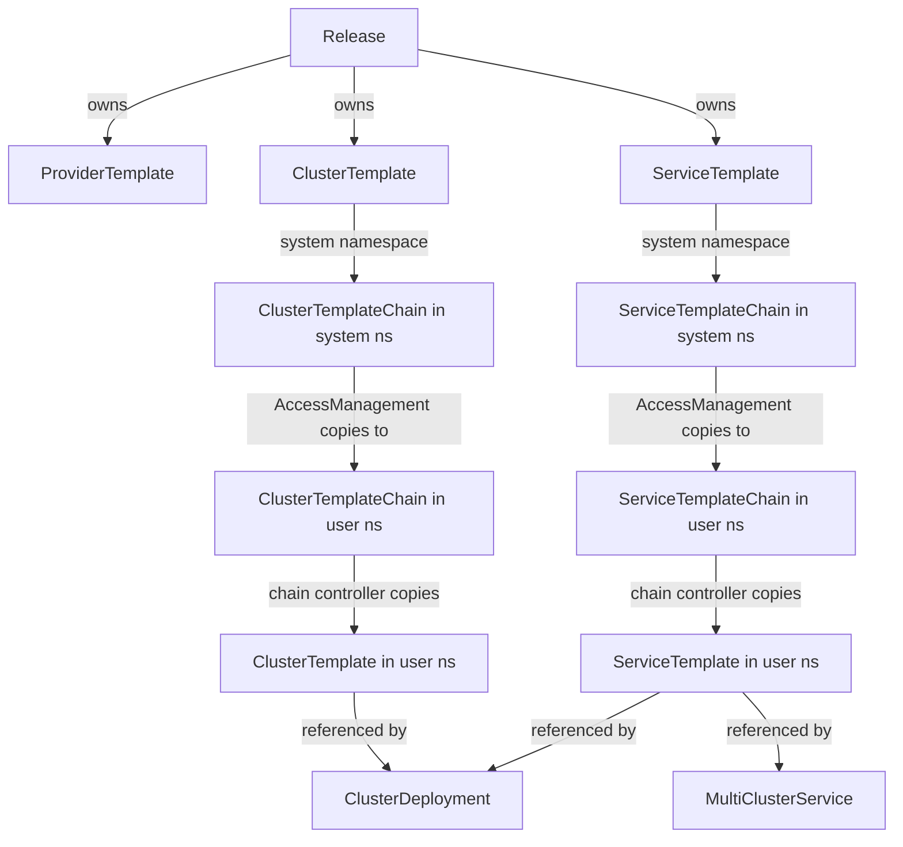
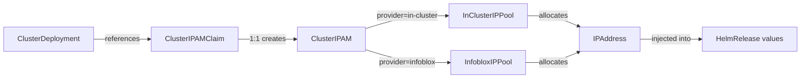

# KCM Controller Reference

This document describes the Kubernetes controllers that make up k0rdent Cluster Manager (KCM). KCM is a controller-based operator built with [controller-runtime](https://github.com/kubernetes-sigs/controller-runtime) that manages the lifecycle of multi-cluster Kubernetes deployments via [Cluster API (CAPI)](https://cluster-api.sigs.k8s.io/) and [Flux](https://fluxcd.io/).

Each section below covers one controller: what resource it owns, what it watches, what objects it creates or deletes, and how its reconcile loop works.

---

## Overall CRD Relationship Graph

---

## Bootstrap and Dependency Flow

The startup sequence from a fresh install:

---

## Controller Reference

### ReleaseReconciler

**Primary resource:** `Release`
**Package:** `internal/controller/`

#### What it does

`ReleaseReconciler` is the bootstrap controller. It runs in two modes:

1. **Initial install** (no Release object yet): creates a `HelmRepository`, a `HelmChart` for the `kcm-templates` chart, and a corresponding `HelmRelease`. Optionally patches the Flux `source-controller` Deployment to mount the registry CA certificate secret. Once the HelmRelease is ready (meaning all CRD-backed templates are applied to the cluster), it creates the initial `Management` object populated with the default provider list and Helm values from the existing `kcm` release.

2. **Per-Release reconcile**: for each `Release` CR, creates or updates a `HelmChart` and `HelmRelease` owned by that Release. After templates are created it validates that all `ProviderTemplate` objects referenced by the Release are valid and marks `Release.Status.Ready = true`.

#### Watches

| Object | Filter |
|---|---|
| `Release` | Create / Update only (Delete and Generic events ignored) |
| Generic channel | One-shot event at startup to trigger bootstrap |

#### Objects created / updated

- `HelmRepository` (Flux) — default chart repository
- `HelmChart` (Flux source) — references the `kcm-templates` chart version
- `HelmRelease` (Flux helm-controller) — installs the templates chart
- `Deployment` (apps/v1) — patches `source-controller` to add registry CA volume (initial install only)
- `Management` — created once on initial install

#### Status conditions

| Condition | Meaning |
|---|---|
| `TemplatesCreated` | HelmRelease for templates chart is ready |
| `TemplatesValid` | All ProviderTemplates referenced by the Release are valid |
| `Ready` (derived) | Both conditions above are True |

#### Reconcile flowchart

---

### ManagementReconciler

**Primary resource:** `Management`
**Package:** `internal/controller/`

#### What it does

`ManagementReconciler` is the central orchestrator. It reads the singleton `Management` CR and installs all configured CAPI providers by creating Flux `HelmRelease` / `HelmChart` / `HelmRepository` objects (via `components.Reconcile()`). It also:

- Ensures the singleton `AccessManagement` object exists.
- Ensures the built-in `StateManagementProvider` (for Sveltos) exists.
- On upgrade (when `spec.release != status.release`), creates `ManagementBackup` objects before proceeding if Velero is installed.
- Once the Sveltos provider component reports success, dynamically registers `ClusterDeploymentReconciler` and `MultiClusterServiceReconciler` with the controller manager.
- On deletion, suspends and removes all KCM-managed `HelmRelease`, `HelmChart`, and `HelmRepository` objects before removing its finalizer.

#### Watches

| Object | Filter |
|---|---|
| `Management` | All events |
| `Release` | ReadyCondition changes (when webhook disabled) |
| `ProviderTemplate` | Transitions from invalid → valid (when webhook disabled) |

#### Objects created / deleted

- `AccessManagement` — created once if `CreateAccessManagement` flag is set
- `StateManagementProvider` — created once when Sveltos component is present in spec
- `ManagementBackup` — created before upgrades when Velero is present
- `HelmRelease` / `HelmChart` / `HelmRepository` — created by `components.Reconcile()`, deleted on Management deletion

#### Status conditions

| Condition | Meaning |
|---|---|
| `Ready` | All components in `status.components` report success and `status.release == spec.release` |

#### Reconcile flowchart

---

### ClusterTemplateReconciler

**Primary resource:** `ClusterTemplate`
**Package:** `internal/controller/`

#### What it does

Validates a `ClusterTemplate` by downloading its Helm chart (via the Flux `HelmChart` artifact), extracting provider annotations, default values, and JSON schema. Stores the chart reference and schema in status; creates a `ConfigMap` containing the JSON schema if the chart includes one.

#### Watches

| Object | Filter |
|---|---|
| `ClusterTemplate` | Generation change |
| `Management` | `status.availableProviders` list changes — re-enqueues all ClusterTemplates that reference any changed provider |

#### Objects created / updated

- `HelmChart` (Flux source) — references the chart defined in `spec.helm.chartSpec`
- `ConfigMap` — stores the Helm chart JSON schema (named `schema-ct-<template-name>`)

#### Status conditions

| Field | Meaning |
|---|---|
| `status.valid` | Chart downloaded and validated successfully |
| `status.validationError` | Reason when invalid |

---

### ServiceTemplateReconciler

**Primary resource:** `ServiceTemplate`
**Package:** `internal/controller/`

#### What it does

Same core logic as `ClusterTemplateReconciler` (via the shared `TemplateReconciler.ReconcileTemplate()`). Additionally supports non-Helm sources: `OCIRepository`, `GitRepository`, and `Bucket` (Flux source types) when `spec.helm.chartSpec` points to a remote source. Creates or updates the appropriate Flux source object and references it via `chartRef`.

#### Objects created / updated

- `HelmChart` (Flux) — when spec uses `chartSpec`
- `OCIRepository` / `GitRepository` / `Bucket` — when spec uses a remote source
- `ConfigMap` — schema (named `schema-st-<template-name>`)

---

### ProviderTemplateReconciler

**Primary resource:** `ProviderTemplate`
**Package:** `internal/controller/`

#### What it does

Same validation flow as the other template controllers. Additionally sets `OwnerReferences` from all `Release` objects that reference this template (via `ReleaseTemplatesIndexKey` index).

#### Watches

| Object | Filter |
|---|---|
| `ProviderTemplate` | Generation change |
| `Release` | Create events only — enqueues all templates listed in `Release.Templates()` |

#### Objects created / updated

- `HelmChart` (Flux source)
- `ConfigMap` — schema (named `schema-pt-<template-name>`)

---

### ClusterTemplateChainReconciler

**Primary resource:** `ClusterTemplateChain`
**Package:** `internal/controller/`

#### What it does

`ClusterTemplateChain` defines a set of `ClusterTemplate` names that are available in a namespace along with the allowed upgrade paths between them. The reconciler copies those `ClusterTemplate` objects from the system namespace into the chain's namespace, adding the `k0rdent.mirantis.com/managed=true` label and an `OwnerReference` pointing to the chain. Objects that are no longer referenced are deleted.

Only chains that carry the KCM-managed label and live outside the system namespace are processed (chains in the system namespace are the source of truth; AccessManagement creates namespace copies).

#### Objects created / updated / deleted

- `ClusterTemplate` copies in target namespaces (owned by the chain)

---

### ServiceTemplateChainReconciler

**Primary resource:** `ServiceTemplateChain`
**Package:** `internal/controller/`

#### What it does

Mirrors `ClusterTemplateChainReconciler` for service templates. Copies `ServiceTemplate` objects from the system namespace into the chain's namespace. Handles both Helm-backed and non-Helm-backed (OCIRepository / GitRepository / Bucket) service templates, rewriting source references to cross-namespace safe forms (ConfigMap / Secret sources are blocked for security reasons).

#### Objects created / updated / deleted

- `ServiceTemplate` copies in target namespaces

---

### AccessManagementReconciler

**Primary resource:** `AccessManagement`
**Package:** `internal/controller/`

#### What it does

`AccessManagement` is a singleton cluster-scoped resource that defines access rules: which `ClusterTemplateChain`, `ServiceTemplateChain`, `Credential`, `ClusterAuthentication`, and `DataSource` objects should be available in which namespaces (selected by name list or label selector).

For each access rule the reconciler:
1. Resolves target namespaces (by list or label selector).
2. Creates missing `ClusterTemplateChain` / `ServiceTemplateChain` copies (which in turn trigger the chain controllers to populate templates).
3. Creates `Credential`, `ClusterAuthentication`, and `DataSource` copies in each target namespace.
4. Deletes previously managed copies that are no longer referenced by any rule.

#### Watches

| Object | Filter |
|---|---|
| `AccessManagement` | All events |

#### Objects created / deleted in target namespaces

- `ClusterTemplateChain`
- `ServiceTemplateChain`
- `Credential`
- `ClusterAuthentication`
- `DataSource`

#### Reconcile flowchart

---

### CredentialReconciler

**Primary resource:** `Credential`
**Package:** `internal/controller/`

#### What it does

Validates a `Credential` by looking up its referenced `ClusterIdentity` object (the CAPI provider-specific identity, e.g., `AWSClusterStaticIdentity`). When the credential references a `Region`, it uses the regional cluster's kubeconfig to verify the identity exists on that cluster. Also copies `ClusterIdentity` objects to regional clusters via `credential.CopyClusterIdentities()`. Periodic sync every 15 minutes.

On deletion, releases (removes finalizer from) `ClusterIdentity` objects on the regional cluster.

#### Watches

| Object | Filter |
|---|---|
| `Credential` | All events |
| `Region` | ReadyCondition changes — re-enqueues all credentials that reference the region |

#### Status conditions

| Condition | Meaning |
|---|---|
| `CredentialReady` | ClusterIdentity exists and is accessible |

---

### ClusterDeploymentReconciler

**Primary resource:** `ClusterDeployment`
**Package:** `internal/controller/`

**Note:** This controller is registered dynamically by `ManagementReconciler` only after the Sveltos provider is ready.

#### What it does

`ClusterDeploymentReconciler` provisions a CAPI cluster by rendering the referenced `ClusterTemplate` Helm chart values and creating a Flux `HelmRelease`. It also:

- Optionally resolves a `Region` for the deployment and obtains a regional client.
- Resolves an optional `ClusterAuthentication` for kubeconfig authentication.
- Resolves an optional `ClusterIPAMClaim` for IP address management.
- Creates a `ServiceSet` for any services defined in `spec.services`.
- Creates a `ClusterDataSource` if a `DataSource` is referenced.
- On deletion, waits for cloud resources (CAPI cluster objects) to be fully deleted before removing its finalizer.

#### Objects created / updated

- `HelmRelease` (Flux) — installs the CAPI cluster chart
- `ServiceSet` — if `spec.services` is non-empty
- `ClusterDataSource` — if a DataSource is referenced

#### Status conditions

| Condition | Meaning |
|---|---|
| `TemplateReady` | ClusterTemplate is valid |
| `HelmChartReady` | Flux HelmChart artifact is available |
| `HelmReleaseReady` | Flux HelmRelease installed successfully |
| `CAPIClusterSummary` | CAPI Cluster object status |
| `SveltosClusterReady` | Sveltos has registered the cluster |
| `CloudResourcesDeleted` | All cloud resources deleted (deletion only) |

#### Reconcile flowchart

---

### MultiClusterServiceReconciler

**Primary resource:** `MultiClusterService`
**Package:** `internal/controller/`

**Note:** Registered dynamically after Sveltos is ready.

#### What it does

`MultiClusterServiceReconciler` deploys a set of services to all `ClusterDeployment` objects that match `spec.clusterSelector`. For each matching cluster it creates or updates a `ServiceSet`. When a cluster stops matching the selector (its labels change), the corresponding `ServiceSet` is deleted.

The controller validates:
1. All referenced `ServiceTemplate` objects exist and are valid.
2. Service dependency ordering is consistent (no cycles).
3. `MultiClusterService` dependency ordering (`spec.dependsOn`) is satisfied before creating a `ServiceSet` for a cluster.

On deletion, removes all owned `ServiceSets` and waits for them to be gone before removing its finalizer.

#### Watches

| Object | Filter |
|---|---|
| `MultiClusterService` | Generation change |
| `ServiceSet` | Any change — re-enqueues the owning MCS |
| `ServiceTemplate` | Invalid → valid transitions (when webhook disabled) |

#### Objects created / deleted

- `ServiceSet` per matching `ClusterDeployment`

#### Status conditions

| Condition | Meaning |
|---|---|
| `ServicesReferencesValidation` | All service templates found and valid |
| `ServicesDependencyValidation` | Service ordering is acyclic and consistent |
| `MultiClusterServiceDependencyValidation` | MCS `dependsOn` graph is satisfiable |
| `ClusterInReadyState` | `readyDeployments/totalDeployments` across ServiceSets |
| `Ready` | Derived from all above |

---

### ManagementBackupReconciler

**Primary resource:** `ManagementBackup`
**Package:** `internal/controller/backup/`

#### What it does

`ManagementBackupReconciler` creates Velero `Backup` or `Schedule` objects on the management cluster and on each regional cluster. A `ManagementBackup` can run as a one-time backup or on a cron schedule.

The reconciler constructs a *scope* by listing all `ClusterDeployment` objects and building regional clients for any cluster that references a `Region`. It then creates one Velero object per cluster (management + regions).

A periodic runner enqueues all `ManagementBackup` objects every minute to keep schedules up-to-date.

#### Objects created

- `velero/v1.Backup` — for one-time backups, on the management and each regional cluster
- `velero/v1.Schedule` — for scheduled backups

#### Status fields

| Field | Meaning |
|---|---|
| `status.lastBackupName` | Most recent management-cluster backup name |
| `status.regionsLastBackups[]` | Per-region backup name and status |
| `status.error` | Last reconcile error message |

---

### region.Reconciler

**Primary resource:** `Region`
**Package:** `internal/controller/region/`

#### What it does

`region.Reconciler` installs KCM provider components on a remote *regional* cluster referenced by the `Region` CR (either via a `ClusterDeployment` reference or a direct kubeconfig Secret). It mirrors the management cluster's behaviour but targets the regional cluster:

- Copies the regional cluster kubeconfig secret to the system namespace.
- Copies registry certificate secrets to the regional cluster.
- Calls `components.Reconcile()` to install the CAPI providers on the regional cluster (via `HelmRelease` objects that target that cluster's kubeconfig).
- On deletion, removes all HelmRelease objects for that region in dependency order, then deletes regional secrets.

#### Watches

| Object | Filter |
|---|---|
| `Region` | Generation change |
| `Management` | `spec.release` field changes — re-enqueues all Regions |

#### Objects created / deleted

- `HelmRelease` (Flux, targeting the regional cluster kubeconfig) — one per component
- `Secret` copies (kubeconfig, registry cert) in the system namespace and on the regional cluster

#### Status conditions

| Condition | Meaning |
|---|---|
| `Ready` | All regional components healthy (mirrors Management `Ready` logic) |

#### Reconcile flowchart

---

### ipam.ClusterIPAMClaimReconciler

**Primary resource:** `ClusterIPAMClaim`
**Package:** `internal/controller/ipam/`

#### What it does

`ClusterIPAMClaim` is a user-facing resource that describes the IP address requirements for a cluster (node network CIDR, cluster network CIDR, external network). The reconciler:

1. Validates the claim (checks IP / CIDR notation).
2. Creates or updates a `ClusterIPAM` object (1:1 with the claim, same name, same namespace, owned by the claim).
3. Updates `status.bound` by reading `ClusterIPAM.status.phase`.

Tracks IPAM usage and claim metrics.

#### Objects created

- `ClusterIPAM` (owned by the claim)

#### Status fields

| Field/Condition | Meaning |
|---|---|
| `status.bound` | True when ClusterIPAM.status.phase == Bound |
| `InvalidClaim` condition | Set when IP/CIDR notation is invalid |

---

### ipam.ClusterIPAMReconciler

**Primary resource:** `ClusterIPAM`
**Package:** `internal/controller/ipam/`

#### What it does

`ClusterIPAMReconciler` is the implementation-side controller. It reads the associated `ClusterIPAMClaim` and selects an IPAM adapter based on `spec.provider`. Current adapters:

- **in-cluster**: creates an `InClusterIPPool` CR.
- **infoblox**: creates an `InfobloxIPPool` CR.

Sets `status.phase = Pending` initially, then `Bound` once the adapter reports readiness. Requeues every 10 seconds until bound.

#### Status fields

| Field/Condition | Meaning |
|---|---|
| `status.phase` | `Pending` or `Bound` |
| `status.providerData` | Provider-specific IP allocation data |
| `IPAMProviderConditionError` | Set when adapter fails |

---

### sveltos.ServiceSetReconciler

**Primary resource:** `ServiceSet`
**Package:** `internal/controller/adapters/sveltos/`

#### What it does

`ServiceSetReconciler` translates a `ServiceSet` object (the internal, provider-agnostic representation of services to deploy) into Sveltos `Profile` or `ClusterProfile` resources. It:

1. Gets the `StateManagementProvider` and verifies its selector matches the ServiceSet.
2. Builds a Sveltos profile spec from the ServiceSet's service list (Helm charts, Kustomizations, raw policy refs).
3. Creates or updates a `Profile` (namespace-scoped) or `ClusterProfile` (cluster-scoped / self-management).
4. Collects status back from Sveltos `ClusterSummary` objects and populates `ServiceSet.Status.Services[]`.

A background poller runs every 30 seconds and re-enqueues all `ServiceSet` objects to keep status fresh.

#### Objects created / updated

- `addoncontrollerv1beta1.Profile` — for per-namespace cluster targets
- `addoncontrollerv1beta1.ClusterProfile` — for cluster-scoped / self-management

#### Status fields

| Field | Meaning |
|---|---|
| `status.services[]` | Per-service state: Deployed / Failed / Pending / Provisioning / Deleting |
| `status.deployed` | True when all services are Deployed |
| `status.cluster` | Reference to the owning cluster |
| `ServiceSetProfileCondition` | Profile created/updated successfully |
| `ServiceSetStatusesCollected` | ClusterSummary statuses synced |

---

### statemanagementprovider.Reconciler

**Primary resource:** `StateManagementProvider`
**Package:** `internal/controller/statemanagementprovider/`

#### What it does

`StateManagementProvider` describes a service-deployment backend (currently Sveltos). The reconciler:

1. Creates a `ServiceAccount`, `ClusterRole`, and `ClusterRoleBinding` for the adapter workload.
2. Watches the `Adapter` deployment (e.g., the KCM controller itself) and verifies it meets the readiness CEL expression in `spec.adapter.readinessRule`.
3. Watches each `Provisioner` deployment (e.g., the Sveltos `addon-controller`) and verifies readiness.
4. Verifies all `ProvisionerCRDs` (e.g., `profiles.projectsveltos.io`) exist in the cluster.
5. Sets `status.ready = true` only when all of the above pass.

Requeues every 10 seconds until ready.

#### Objects created

- `ServiceAccount` (named `<smp-name>-sa`)
- `ClusterRole` (named `<smp-name>-cr`)
- `ClusterRoleBinding` (named `<smp-name>-crb`)

#### Status conditions

| Condition | Meaning |
|---|---|
| `RBACReady` | ServiceAccount / ClusterRole / ClusterRoleBinding exist |
| `AdapterReady` | Adapter deployment meets readiness rule |
| `ProvisionerReady` | All provisioner deployments meet readiness rules |
| `ProvisionerCRDsReady` | All required CRDs exist |
| `Ready` (derived) | All above are True |

---

## Admission Webhooks

| Webhook | ValidateCreate | ValidateUpdate | ValidateDelete |
|---|---|---|---|
| `ClusterDeployment` | Validate template + credential + services exist and are valid | Validate upgrade path (template chains); reject if paused | Reject if deletion is in progress |
| `Management` | Validate Release is ready | Check provider removal doesn't break existing ClusterDeployments; validate CAPI contracts | Reject if any ClusterDeployment exists |
| `ClusterTemplate` | — | — | Reject if any ClusterDeployment references it |
| `ServiceTemplate` | — | — | Reject if any ClusterDeployment or MultiClusterService references it |
| `ProviderTemplate` | — | — | Reject if referenced by a Release or currently installed in Management |
| `ClusterTemplateChain` | Validate spec (supported templates form a valid graph) | — | — |
| `ServiceTemplateChain` | Validate spec | — | — |
| `Release` | — | — | Reject if Management references it |
| `Region` | Validate cluster reference | Check provider removal safety | Reject if any ClusterDeployment uses it |
| `AccessManagement` | Reject if another AccessManagement already exists (singleton) | — | Reject if Management still exists |
| `ClusterAuthentication` | Validate referenced secret exists | — | — |

---

## Cross-Controller Data Flow

The sequence below shows the end-to-end flow from a new Release to services running on a managed cluster:

---

## Template Distribution Flow

---

## IPAM Flow

